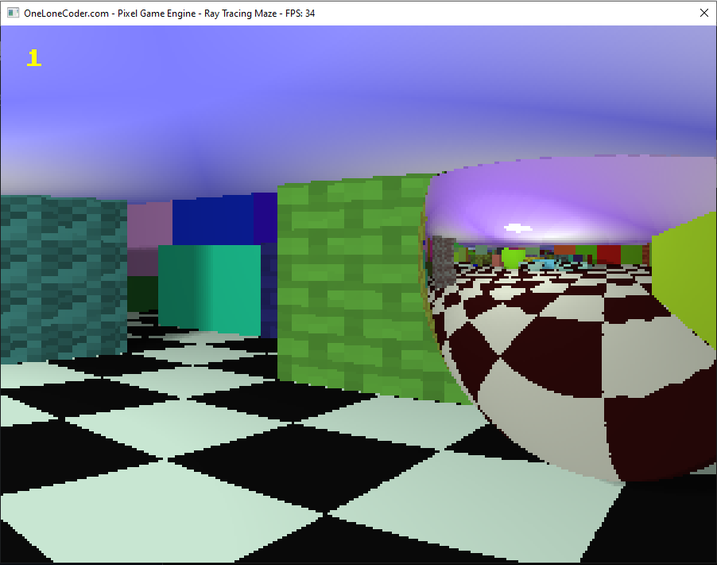

# RayTracingMazeCppOLC

Simple ray tracing game in C++, originally developed in [Python](https://github.com/FinFetChannel/pytracingMaze), which in turn was based on my [ray casting project](https://github.com/FinFetChannel/RayCastingPythonMaze). As you may have guessed, things started to get a bit heavy for Python and my poor optimization skills, still, developing the proof of concept with Python was worth it as i don't have much experience in C++ (as you can clearly see by just looking at the code).



## Intro

### Rays

The basic approach is to trace rays of light in the reverse direction, starting from the camera and interacting with the environment, with three basic types of rays:

* Vision rays - Initial rays that shoots from the camera and returns the coordinates where it has hit something
* Reflection rays - Secondary rays cast when a vision ray hits a reflective surface, the new direction is the reflection of vision ray in relation to the normal vector of the surface, can have several bounces (reflections inside reflections)
* Shadow rays - Secondary rays that start where the vision ray has hit something and goes in the direction of the light

### Maps

Maps are defined by grids, with different maps for different features: wall positions, colors, heights, reflectivities, textures and geometry (spheres or prisms). The maps are generated randomly, so each level and each game is a bit different. For that, a random walker algorithm is used, removing some walls from the map while traversing it, giving preference to pre-existing paths carved randomly.

### Game logic

The player starts on one side of the map and has the objective of finding a blue floor patch on the opposite side of the map. At each level the size of map gets bigger.

### Inputs

Basic inputs are similar to FPS games, with WASD for movement and mouse for orientation (optionally QERF), the esc key is reserved for quitters.

### Engine

The game is built on top of the [PixelGameEngine](https://github.com/OneLoneCoder/olcPixelGameEngine) from [javidx9](https://www.youtube.com/channel/UC-yuWVUplUJZvieEligKBkA).

## Code

The code is a bit messy, following the basic structure:

* Variables initialization
* Level loop
   * Initialize level - OnUserCreate()
   	* Generate random map
   * Game loop - OnUserUpdate()
      * Check inputs
      * Movement
      * Pixel loop
         * Initialize Vision ray
         * Vision Ray loop
            * Increment until reaching some surface
            * If hit reflective suface, reflect ray direction, else break out
         * Initialize Shadow ray
         * Shadow Ray loop
            * Increment until reaching light or blocked by something
         * Draw pixel
    * Check if reached end of level

Complexity arises from the different branches on block features wich nay be combined (reflectivity, geometry, texture).

### Variables initialization

Several variables have to be initialized related to: maps, player's position and orientation, light position and additional support variables.

<details>
  <summary>Imports, map and initialization:</summary>

```c++
#define OLC_PGE_APPLICATION
#include "olcPixelGameEngine.h"

int Wsize; int level; // map size, current level
int Wmap[100][100]; int Rmap[100][100]; float Hmap[100][100]; int Tmap[100][100]; int Smap[100][100];
float Rc[100][100]; float Gc[100][100]; float Bc[100][100]; // RGB maps

float playerx = 1.5; float playery = 1.5;
int exitx = 1; int exity = 1;
float lx; float ly;
float playerH = 1.5; float playerV = -.1;
float nx; float ny; float nz; float dot;
double dx; double dy; double dz;
double xx; double yy; double zz;
float shade;int r; int g; int b; float rr; float rg; float rb;
bool breaker; float timer = 0;

float mousex; float mousey;
const int screenwidth = 300;
int Spixel = 3; // pixel scaling on screen
const float mod = screenwidth/60; // pixel scaler for field of view (60°)
int sx; int sy; float tr[6][6]; // random texture
float tb[6][4] = {{.95, .99, .97, .78}, // Brick texture
                  {.97, .95, .96, .81},
                  {.82, .81, .83, .78},
                  {.93, .83, .98, .96},
                  {.99, .78, .97, .95},
                  {.81, .78, .82, .82}
                };
```

</details>


### Main() and levels

The main function is responsible for the level management, with a for loop that increases the size of the map at each turn. The player can only advance to the next level if its last position is equal to the last exit position. The light position is always set to the middle of the level and the player's position is reset.

<details>
  <summary>Main() and levels</summary>

```c++
int main()
{
	for (int x = 0; x < 10; x++)
    {
        if (int(playerx) == exitx & int(playery) == exity)
        {
            level = x + 1;
            Wsize = level*10;
            playerx = 1.5; playery = 1.5;
            lx = Wsize/2; ly = Wsize/2;
            Example demo;
            if (demo.Construct(screenwidth, int(screenwidth*0.75), Spixel, Spixel))
                demo.Start();
        }

    }
	return 0;
}
```

</details>

### Setting up a level

The setup of a level is the process of generating a map of a given size. Firstly, a map is generated with blocks in random locations and random features, except on the edges of the map, where there are always full-height prismatic walls. After that, a random walker tries to reach the opposite side of the map, in the process some blocks are removed to give way. When it reaches the other side, the location is marked as the exit of the level. Also, a random texture is generated for every new level.

<details>
  <summary>Level setup</summary>

```c++
bool OnUserCreate() override
	{
	srand (time(NULL));
	for (int x = 0; x < Wsize; x++)
		for (int y = 0; y < Wsize; y++)
           	{
                	Rmap[x][y] = int(((float) rand()) / (float) RAND_MAX + 0.2); // Reflective?
			
                	if (int(((float) rand()) / (float) RAND_MAX + 0.2)) // Textured?
                   		Tmap[x][y] = rand()%2 + 1;
                	else
                    		Tmap[x][y] = 0;
				
               		Rc[x][y] = rand()%255; Gc[x][y] = rand()%255; Bc[x][y] = rand()%255; // RGB
			
                	if(x == 0 || y == 0 || x == Wsize-1 || y == Wsize-1){
                    		Wmap[x][y] = 1; Hmap[x][y] = 1; Smap[x][y] == 0;}
                	else
			{
                    		Wmap[x][y] = int(((float) rand()) / (float) RAND_MAX + 0.5);
                    		Hmap[x][y] = 0.2 + 0.6*(((float) rand()) / (float) RAND_MAX );
                    		Smap[x][y] = int(((float) rand()) / (float) RAND_MAX + 0.2);
                	}
            	}
	
        Wmap[int(playerx)][int(playery)] = 0; // Remove wall fron starting position
	
        int x = int(playerx); int y = int(playery);  int cont = 0;
	
        while (1){
            int testx = x; int testy = y;
	    
            if (((float) rand()) / (float) RAND_MAX > 0.5)
            	testx += (rand()%2)*2 - 1;
            else
            	testy += (rand()%2)*2 - 1;
		
            if (testx > 0 & testx < Wsize -1 & testy > 0 & testy < Wsize -1){
                if (Wmap[testx][testy] == 0 || cont > 5){ // move to new position if not wall or counter reached limit
                    cont = 0; x = testx; y = testy; Wmap[x][y] = 0;
                    if (x == Wsize-2){
                        exitx = x; exity = y; // set exit of the maze
                        break;
                    }
                }
                else
                    cont += 1; // increase counter if cannot move
            }
        }
        for (int x = 0; x < 6; x++) // generate a random texture
		for (int y = 0; y < 6; y++)
                	tr[x][y] = 0.5 + 0.4*(((float) rand()) / (float) RAND_MAX);
	return true;
	}
```

</details>

### User inputs and movement

Every frame the player's position and orientation are updated according to keyboard and mouse inputs, but the player can only move if the intended new position is not a wall.

<details>
  <summary>Input and movement</summary>

```c++
bool OnUserUpdate(float fElapsedTime) override
{
	// user inputs
        if (int(mousex) != float(GetMouseX())) playerH += 12*(float(GetMouseX()) - mousex)/ScreenWidth();
        if (int(mousey) != float(GetMouseY())) playerV += 3*(float(GetMouseY()) - mousey)/ScreenHeight();
        if (playerV > 0.5)playerV = 0.5; if (playerV < -0.5)playerV = -0.5;
        mousex = float(GetMouseX()); mousey = float(GetMouseY());

        if (GetKey(olc::Key::Q).bHeld) playerH += -1* fElapsedTime; // turn left
        if (GetKey(olc::Key::E).bHeld) playerH += 1* fElapsedTime; // turn right
        if (GetKey(olc::Key::R).bHeld) playerV += 1* fElapsedTime; // turn up
        if (GetKey(olc::Key::F).bHeld) playerV += -1* fElapsedTime; // turn down
        if (GetKey(olc::Key::ESCAPE).bHeld) return 0; // quit
        float px = playerx; float py = playery;

        if (GetKey(olc::Key::W).bHeld){ // Forwards
            px += cos(playerH)*2.f * fElapsedTime; py += sin(playerH)*2.f * fElapsedTime;}
        if (GetKey(olc::Key::S).bHeld){ // Backwards
            px += -cos(playerH)*2.f * fElapsedTime; py += -sin(playerH)*2.f * fElapsedTime;}
        if (GetKey(olc::Key::A).bHeld){ // Leftwards
            px += sin(playerH)*2.f * fElapsedTime; py += -cos(playerH)*2.f * fElapsedTime;}
        if (GetKey(olc::Key::D).bHeld){ // Rightwards
            px += -sin(playerH)*2.f * fElapsedTime; py += cos(playerH)*2.f * fElapsedTime;}
        if (!Wmap[int(px)][int(py)]){ // only moves if not wall
            playerx = px; playery = py;}
...
```

</details>

### Casting rays

Rays are cast for each pixel, starting at the players current position with directions spaced uniformly in the pixel grid for a field of view of 60° horizontally and 45° vertically. When a ray hits something a few checks need to be made for height, shape, reflectivity, color and texture. After the base color of the pixel is defined, a new ray is cast from the last known position in the direction of the light to check if there is something directly blocking the light. Shadows are not affected by reflections for simplification.


<details>
  <summary>Generic rays</summary>

```c++
...
timer += fElapsedTime/5; // funky lights
lx = Wsize/2 + sin(timer);
ly = Wsize/2 + cos(timer);

// draw pixel after pixel
for (int x = 0; x < ScreenWidth(); x++)
   for (int y = 0; y < ScreenHeight(); y++)
       {
                xx = playerx; yy = playery; zz = 0.5;
                float Hangle = playerH + x*0.017453/mod - 0.523598;
                float Vangle = playerV + y*0.017453/mod - 0.393699;
                dx = cos(Hangle)*0.04/mod; dy = sin(Hangle)*0.04/mod; dz = -sin(Vangle)*0.04/mod;
                shade = 1;
                r = 255; g = 255; b = 255;

                breaker = false; // break from functions
                while(1)
                {
                    xx += dx; yy += dy; zz += dz;
                    if (zz > 1) // ceiling
                    {
                        if (pow((xx-lx),2) + pow((yy-ly),2) < 0.1){
                            r = 255; g = 255; b = 255; break;
                            }
                        else{
                            float shade2 = 0.25 * (abs(sin(yy+ly)+ sin(xx+lx))+2);
                            r = 255*shade2; g = 255*shade2; b = 255; break;
                        }
                    }
                    if (zz < 0) // floor
                    {
                        if (int(2*xx)%2 == int(2*yy)%2){
                            if (int(xx) == exitx & int(yy) == exity){
                                r = 0; g = 0; b = 255;}
                            else{
                                r = 10; g = 10; b = 10;}
                        }
                        else{
                            r = 200; g = 230; b = 210;}
                        break;
                    }
                    if (Wmap[int(xx)][int(yy)]) // walls
                    {
                        if (Hmap[int(xx)][int(yy)] >= zz)
                        {
                            if (Smap[int(xx)][int(yy)])// Spheres
                                sphere_stuff();
                            else
                            {
                                if (Rmap[int(xx)][int(yy)]) // reflections
                                    reflection_stuff();
                                else
                                {
                                    r = Rc[int(xx)][int(yy)]; g = Gc[int(xx)][int(yy)]; b = Bc[int(xx)][int(yy)]; // regular surface
                                    if (Tmap[int(xx)][int(yy)] != 0)
                                        texture_stuff();
                                break;
                                }
                            }
                        }

                    }
                    if (breaker)
                        break;
                }

                shading();
	}
				
```

</details>

#### First case: Regular walls with different heights and textures

The simplest case is when a ray hits a prismatic wall, that is, the checks for spheres and reflective blocks have failed. Then a base color for the pixel is retrieved and the texture is checked.

<details>
  <summary>Regular walls</summary>

```c++
void texture_stuff()
{
    if (yy - int(yy) < 0.05 || yy - int(yy) > 0.95)
        sx = int((xx*3 - int(3*xx))*4);
    else
        sx = int((yy*3 - int(3*yy))*4);
    if (xx - int(xx) < 0.95 & xx - int(xx) > 0.05 & yy - int(yy) < 0.95 & yy - int(yy) > 0.05)
        sy = int((xx*5 - int(5*xx))*6);
    else
        sy = int((zz*5 - int(5*zz))*6);
    if (Tmap[int(xx)][int(yy)] == 2){
        r = r*tr[sy][sx]; g = g*tr[sy][sx]; b = b*tr[sy][sx];
    }
    else{
        r = r*tb[sy][sx]; g = g*tb[sy][sx]; b = b*tb[sy][sx];
    }
}
```

</details>

#### Second case: reflective prismatic walls

Reflective prismatic walls simply invert one of the components of direction of the rays. Surfaces facing up invert the z direction, sufaces facing the y direction (paralell to the xz plane) reflect the y direction and the same for the x direction. For that we can probe the blocks to sense which side of the wall we hit. A shading factor is introduced in reflections, making the darker while limiting the maximum number of reflections when a threshhold is reached. The color of the firs mirror is saved for a tinted mirror effect.

<details>
  <summary>Imports, map and initialization:</summary>

```c++
void reflection_stuff()
{
    if (shade == 1){
        rr = Rc[int(xx)][int(yy)]; rg = Gc[int(xx)][int(yy)]; rb = Bc[int(xx)][int(yy)];} // tinted mirrors
    else{
        rr = 0.5*(rr + Rc[int(xx)][int(yy)]); rg = 0.5*(rg + Gc[int(xx)][int(yy)]); rb = 0.5*(rb + Bc[int(xx)][int(yy)]);}
    shade = shade*0.7;
    if (shade < 0.1){
        r = 0; g = 0; b = 0;
        breaker = true;
    }
    if (abs(Hmap[int(xx)][int(yy)] - zz) <= abs(dz)) // horizontal surface
        dz = -dz;
    else{
        if (Hmap[int(xx+dx)][int(yy-dy)] == Hmap[int(xx)][int(yy)])
            dx = -dx; // y surface
        else
            dy = -dy; // x surface
    }
    xx += dx; yy += dy; zz += dz;
}
```
</details>

#### Third case: Spheres
Spheres allow for rays to pass through the corners of the walls when the distance to the center of the block is greater than the radius of the sphere. Spheres may also have reflections, the difference is that the new direction of the ray is calculated by reflecting it around the normal of the surface. Spheres can also be textured, but the texture mapping does not consider the curvature of the surface.

<details>
  <summary>Spheres</summary>

```c++
void sphere_stuff()
{
    if (pow(xx-int(xx)-0.5,2)+pow(yy-int(yy)-0.5,2)+pow(zz-int(zz)-0.5,2) < 0.25)
    {
        if (Rmap[int(xx)][int(yy)]) // spherical mirrors
        {
            if (shade == 1){
                rr = Rc[int(xx)][int(yy)]; rg = Gc[int(xx)][int(yy)]; rb = Bc[int(xx)][int(yy)];} // tinted mirrors
            else{
                rr = 0.5*(rr + Rc[int(xx)][int(yy)]); rg = 0.5*(rg + Gc[int(xx)][int(yy)]); rb = 0.5*(rb + Bc[int(xx)][int(yy)]);}
            shade = shade*0.7;
            if (shade < 0.1){
                r = 100; g = 100; b = 100;
                breaker = true;
            }
            if (abs(Hmap[int(xx)][int(yy)] - zz) <= abs(dz)) // horizontal surface
                dz = -dz;
            else{
                nx = (xx-int(xx)-0.5)/0.5; ny = (yy-int(yy)-0.5)/0.5; nz =(zz-0.5)/0.5;
                dot = 2*(dx*nx + dy*ny + dz*nz); // dR = -dI + 2*n*(dI�n)
                dx = (dx - nx*dot); dy = (dy - ny*dot); dz = (dz - nz*dot)*1.2;
            }
            xx += dx; yy += dy; zz += dz;
        }
        else
        {
            r = Rc[int(xx)][int(yy)]; g = Gc[int(xx)][int(yy)]; b = Bc[int(xx)][int(yy)];
            if (Tmap[int(xx)][int(yy)] != 0) // textures on spheres (a bit wonky)
                texture_stuff();
            breaker = true;
        }
    }
}
```

</details>

#### Shadow rays and shading
Before we start the Shadow ray loop, we check if the the shading was affected by reflections to mix the color of the pixel with the color of the mirror. We need to calculate the distance to the light source and new increments in its direction. The shading occurs incrementally, for softer edges, depending on the amount of material that is blocking the light. When a threshhold is reached, the ray is interrupted.

<details>
  <summary>Shading</summary>

```c++
void shading()
{
    float dl = sqrt(pow ((xx-lx),2) + pow((yy-ly),2) + pow((1-zz),2) );
    if (shade < 1){ // tinted mirrors application
        r = sqrt(rr * r); rg = sqrt(rg * g); rb = sqrt(rb * b);
    }

    if (zz<1) // shade ray for everything thats under the ceiling level
        {
            dx = 0.04*(lx-xx)/dl; dy = 0.04*(ly-yy)/dl; dz = 0.04*(1-zz)/dl; // light direction
            while(1)
            {
                xx += dx; yy += dy; zz += dz;
                if (Wmap[int(xx)][int(yy)] & Hmap[int(xx)][int(yy)] >= zz)
                    if (!Smap[int(xx)][int(yy)] || (Smap[int(xx)][int(yy)] & (pow(xx-int(xx)-0.5,2)+pow(yy-int(yy)-0.5,2)+pow(zz-int(zz)-0.5,2) < 0.25)))
                        shade = shade*0.9;
                if (zz > 1 || shade<0.4)
                    break;
            }
        }
    shade = sqrt(shade*(0.4 + 0.6)/(dl/2+0.1));
    if (shade > 1)
        shade  = 1;
}
```

</details>

### Drawing the pixel to the screen and end level

After all that we can draw the pixel to the screen and go to the next one. When finihed we check if the player has reached the exit of the maze and then the level ends. Whe also draw the number of the level on the screen for reference.

<details>
  <summary>Draw pixels, end level</summary>

```c++
				Draw(x, y, olc::Pixel(int(shade*r),int(shade*g), int(shade*b)));
			}
		if (int(playerx) == exitx & int(playery) == exity)
			return false;
		DrawString({ 10,10 }, std::to_string(level), olc::YELLOW);
		return true;
	}
};
```

</details>

## Optimization

The naive approach with small increments is very inefficient. A much more compelling approach is to take advantage of the grid structure of the map, with a DDA algorithm (Digital differential analyzer), as presented by [Lode Vandevenne](https://lodev.org/cgtutor/raycasting.html). Ideally, we would create a grid in the z direction for full optimization with a true voxel space, I'm not doing that. I will simply call the DDA everytime the ray is at an empty cell to find the next non empty one. 

<details>
  <summary>DDA</summary>

```c++
void lodev() //adapted from https://lodev.org/cgtutor/raycasting.html
{
    float posX = xx;
    float posY = yy;
    float norm = sqrt(dx*dx + dy*dy + dz*dz);
    double rayDirX = dx/norm;
    double rayDirY = dy/norm;
    double rayDirZ = dz/norm;

    //which box of the map we're in
    int mapX = int(posX);
    int mapY = int(posY);

    //length of ray from current position to next x or y-side
    double sideDistX;
    double sideDistY;
    double sideDistZ;

    //length of ray from one x or y-side to next x or y-side
    double deltaDistX = abs(1 / rayDirX);
    double deltaDistY = abs(1 / rayDirY);
    double deltaDistZ = abs(1 / rayDirZ);
    double dist;

    //what direction to step in x or y-direction (either +1 or -1)
    int stepX;
    int stepY;

    int hit = 0; //was there a wall hit?
    int side; //was a NS or a EW wall hit?
        //calculate step and initial sideDist
    if (rayDirX < 0)
    {
    stepX = -1;
    sideDistX = (posX - mapX) * deltaDistX;
    }
    else
    {
    stepX = 1;
    sideDistX = (mapX + 1.0 - posX) * deltaDistX;
    }
    if (rayDirY < 0)
    {
    stepY = -1;
    sideDistY = (posY - mapY) * deltaDistY;
    }
    else
    {
    stepY = 1;
    sideDistY = (mapY + 1.0 - posY) * deltaDistY;
    }
    if (rayDirZ < 0)
    sideDistZ = zz*deltaDistZ;
    else
    sideDistZ = (1-zz)*deltaDistZ;
    //perform DDA
    while (hit == 0)
    {
    //jump to next map square, OR in x-direction, OR in y-direction
    if (sideDistX < sideDistY)
    {
      sideDistX += deltaDistX;
      dist = sideDistX;
      mapX += stepX;
      side = 0;
    }
    else
    {
      sideDistY += deltaDistY;
      dist = sideDistY;
      mapY += stepY;
      side = 1;
    }
    //Check if ray has hit a wall
    if (Wmap[mapX][mapY] > 0) hit = 1;
    }
    if (dist == sideDistY)
        dist = dist - deltaDistY;
    else
        dist = dist - deltaDistX;
    if (dist > sideDistZ)
        dist = sideDistZ;
    //dist = dist + 0.01;

    xx = xx + rayDirX*dist;
    yy = yy + rayDirY*dist;
    zz = zz + rayDirZ*dist;
}
```
To use it, we simply inject this code in the ray loop and in the shading loop. This results in a 2 to 3 times increase in performance, not too shabby.

<details>
  <summary>Call for DDA</summary>

```c++
if (Wmap[int(xx)][int(yy)]==0)
{
	lodev(); xx -= dx/2; yy -= dy/2; zz -= dz/2;
}
```
